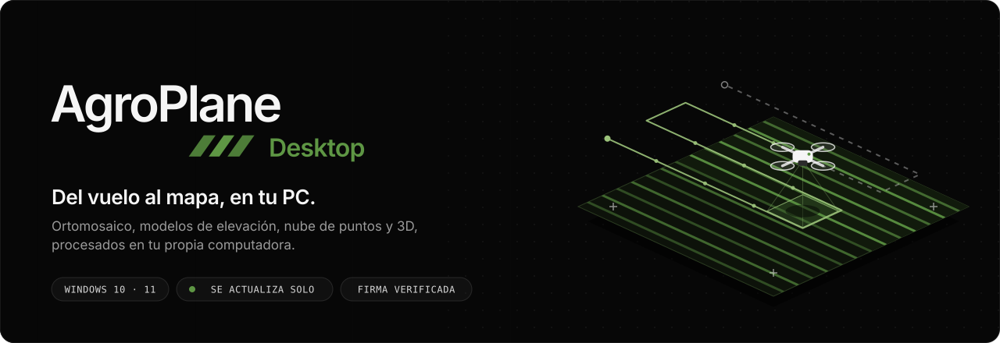
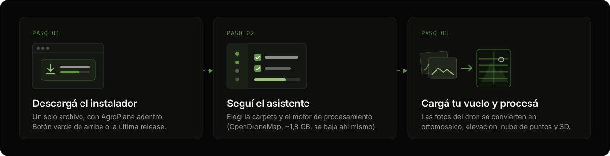
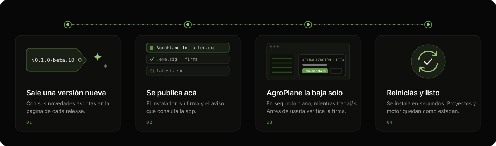

  

  
  
  

  

  
    <a href="https://github.com/voralisdev/agroplane-releases/releases">Todas las versiones</a> ·
    <a href="#-requisitos">Requisitos</a> ·
    <a href="#-preguntas-frecuentes">Preguntas frecuentes</a> ·
    <a href="https://agroplane.com">agroplane.com</a>
  

 

**AgroPlane Desktop** convierte las fotos de un vuelo de dron en mapas listos para trabajar: ortomosaico, modelos de elevación (DSM y DTM), nube de puntos y modelo 3D. Todo se procesa en tu propia computadora, sin subir las fotos a ningún lado, y cuando querés compartir un relevamiento lo publicás en AgroCloud para tus clientes.

Este repositorio es el lugar oficial de descarga: acá se publica cada versión del instalador y de acá la app toma sus actualizaciones.

 

## 🛰️ Instalar en tres pasos

  

1. **Descargá** `AgroPlane-Installer.exe` con el botón verde de arriba.
2. **Abrilo** y seguí el asistente. Te propone instalar en tu usuario (`AppData\Local\Programs\AgroPlane Desktop`) y, si querés, baja el motor de procesamiento OpenDroneMap en el mismo paso.
3. **Abrí AgroPlane**, iniciá sesión, creá un proyecto y cargá las fotos del vuelo.

> [!TIP]
> Si ya tenés AgroPlane instalado, no hace falta desinstalar nada: el asistente detecta la instalación y la actualiza en el mismo lugar, con tus proyectos y el motor intactos.

 

## 🔄 Se actualiza solo

  

AgroPlane revisa este repositorio cada 12 horas. Cuando hay una versión nueva baja solo la aplicación en segundo plano, comprueba que esté firmada por AgroPlane y te avisa cuando está lista. Al tocar **Reiniciar ahora** se actualiza sola en unos segundos, sin instalador y sin pedir permisos.

- **Si algo sale mal, vuelve atrás sola.** Si la versión nueva no llega a abrir, AgroPlane vuelve a la anterior y te avisa. No perdés nada.
- **No corta tu trabajo.** Si hay un procesamiento o una publicación en curso, o cambios sin guardar, te lo avisa antes de reiniciar.
- **No vuelve a bajar el motor.** Solo se reemplaza la aplicación; OpenDroneMap y tus proyectos quedan como estaban.
- **Sin internet no pasa nada.** La app sigue funcionando y busca la actualización la próxima vez.
- **"Más tarde"** deja la actualización descargada: la instalás cuando quieras desde *Configuración › Actualizaciones*.

 

## 📦 Qué trae cada versión

Cada [release](https://github.com/voralisdev/agroplane-releases/releases) incluye sus novedades y estos archivos:

| Archivo | Para qué sirve |
| :-- | :-- |
| `AgroPlane-Installer-X.Y.Z.exe` | El instalador de esa versión, para instalar desde cero. Es el que conviene guardar si necesitás una versión puntual. |
| `AgroPlane-Installer.exe` | El mismo instalador con nombre fijo: el botón de descarga siempre apunta a la última versión. |
| `agroplane-desktop-X.Y.Z.exe` | La aplicación sola. Es lo que baja AgroPlane para actualizarse; no hace falta descargarlo a mano. |
| `*.exe.sig` | Las firmas. La app las verifica antes de instalar; si no coinciden, rechaza la actualización. |
| `latest.json` · `latest-installer.json` | Los avisos que consulta la app para saber si hay una versión nueva y cómo instalarla. |

 

## 💻 Requisitos

| Requisito | Detalle |
| :-- | :-- |
| **Sistema** | Windows 10 u 11 de 64 bits |
| **Componentes de Windows** | WebView2, que ya viene con Windows 10 y 11 actualizados |
| **Motor de procesamiento** | OpenDroneMap, opcional, ~1,8 GB de descarga durante la instalación |
| **Conexión** | Para instalar el motor, iniciar sesión, publicar y recibir actualizaciones. Procesar no la necesita. |
| **Equipo** | Cuanta más memoria RAM, más fotos por vuelo se pueden procesar de una vez. |

 

## ❓ Preguntas frecuentes

<b>Windows dice "Windows protegió su PC". ¿Es seguro?</b>

 

Es el aviso de SmartScreen para programas nuevos que todavía tienen pocas descargas. Si bajaste el instalador desde este repositorio, tocá **Más información → Ejecutar de todos modos**. Las actualizaciones que instala la app van firmadas y se verifican antes de instalarse.

<b>¿Dónde quedan mis proyectos?</b>

 

En `Documentos\AgroPlane`. Ni las actualizaciones ni la desinstalación los tocan.

<b>¿Cómo desinstalo AgroPlane?</b>

 

Desde *Configuración de Windows › Aplicaciones › Aplicaciones instaladas › AgroPlane Desktop › Desinstalar*. Se quitan la aplicación, el motor de procesamiento y los accesos directos. Tus proyectos y tu configuración se conservan, así que si lo volvés a instalar los encontrás como estaban.

<b>Tenía AgroPlane instalado en "Archivos de programa". ¿Cambia algo?</b>

 

Las versiones beta anteriores se instalaban ahí. Se siguen actualizando, pero Windows va a pedir permiso de administrador en cada actualización. Para que se actualice sin preguntar, desinstalalo y volvé a instalar con la carpeta que propone el asistente: tus proyectos no se pierden.

<b>¿Puedo volver a una versión anterior?</b>

 

Sí: bajá el `AgroPlane-Installer-X.Y.Z.exe` de esa versión desde [todas las versiones](https://github.com/voralisdev/agroplane-releases/releases) y ejecutalo. La app va a ofrecer de nuevo la última cuando la detecte.

<b>¿Dónde está el código?</b>

 

AgroPlane no es de código abierto. Este repositorio contiene solo los instaladores publicados y lo que la app necesita para actualizarse.

 

## 💬 Ayuda

¿Algo no anda o tenés una idea? Escribinos a **[ayuda@agroplane.com](mailto:ayuda@agroplane.com)** contándonos qué versión usás (*Configuración › Actualizaciones*) y qué estabas haciendo. Si encontraste un problema de seguridad, usá esa misma dirección: está publicada en [agroplane.com/.well-known/security.txt](https://agroplane.com/.well-known/security.txt).

 

  
    © AgroPlane · <a href="https://agroplane.com/terminos">Términos y condiciones</a> · <a href="https://agroplane.com/privacidad">Privacidad</a> 
    OpenDroneMap es un proyecto de código abierto de su comunidad; AgroPlane lo instala tal como lo publican sus autores.
  

